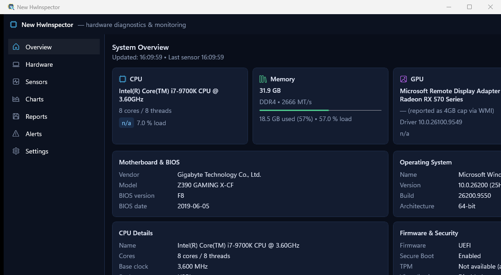

<div align="center">

# ⚡ Hardware Inspector Win

**A modern, lightweight Windows PC hardware inspection & real-time sensor monitoring utility built with WinUI 3 and .NET 8.**

[](https://dotnet.microsoft.com/)
[](https://learn.microsoft.com/windows/apps/winui/winui3/)
[](https://microsoft.com/windows)
[](LICENSE)
[](https://github.com/uponatime2019/HardwareInspectorWin/releases/latest)
[](CONTRIBUTING.md)

<br/>



</div>

---

## 🚀 Try It Now — Zero Install Required

Experience fast, zero-footprint hardware inspection without installers or background services:

1. Download **`HardwareInspectorWin-*-win-x64.zip`** from the [Latest Release](https://github.com/uponatime2019/HardwareInspectorWin/releases/latest).
2. Extract the archive anywhere on your machine.
3. Launch **`HardwareInspectorWin.exe`**.

> **Note**: Self-contained portable build with zero external runtime dependencies. Settings and session logs are kept strictly local in `%LOCALAPPDATA%\HardwareInspectorWin`.

---

## ✨ Features Overview

- 🖥️ **System Overview Dashboard** — Instant high-level summary of your CPU, Motherboard, BIOS, RAM, GPU, Storage volumes, Operating System build, and Security / Firmware capabilities (Secure Boot, TPM, Virtualization).
- 🌲 **Interactive Hardware Tree** — Deep hierarchical inspection of device components with expandable details, property lists, and device IDs.
- ⏱️ **Real-Time Sensor Monitoring** — Live polling of CPU load, memory utilization, temperatures, clock speeds, and disk activity.
- 📈 **Interactive History Charts** — Canvas-rendered live telemetry charts with configurable historical windows (1 to 30 minutes) and dynamic auto-fitting.
- 🚨 **Customizable Alert Engine** — Create threshold rules for critical hardware metrics (e.g., CPU Temp > 85°C) with real-time UI badges and status notifications.
- 📑 **Comprehensive Multi-Format Reports** — Export complete system diagnostics and sensor snapshots to **HTML** (dark-themed), **JSON**, **CSV**, or clean plain **Text**.
- 🔒 **100% Private & Local-Only** — Zero telemetry, zero analytics tracking, and zero internet requests. All hardware information is gathered locally via WMI and Windows OS APIs.
- 🎨 **Modern Windows Fluent UI** — Dark and Light theme support with custom title bar integration and responsive layout.

---

## 🏗️ Architecture & Technology Stack

```
HardwareInspectorWin/
├── App.xaml(.cs)              # Application entry point, global exception logging, theme management
├── MainWindow.xaml(.cs)       # Main window layout, sidebar navigation, real-time status bar
├── Assets/                    # App icons, splash screens, and README screenshots
├── Views/
│   ├── OverviewView.xaml(.cs) # System summary dashboard
│   ├── HardwareView.xaml(.cs) # Tree-based hardware device browser
│   ├── SensorsView.xaml(.cs)  # Live sensor data grid with grouping & search
│   ├── ChartsView.xaml(.cs)   # Interactive telemetry charts
│   ├── AlertsView.xaml(.cs)   # Threshold alerts management
│   ├── ReportsView.xaml(.cs)  # Multi-format diagnostic report exporter
│   └── SettingsView.xaml(.cs) # Configuration, polling intervals, theme settings
├── Services/
│   ├── HardwareService.cs     # WMI query runner & hardware data parser
│   ├── SensorService.cs       # Periodic sensor polling loop & stats calculation
│   ├── ReportService.cs       # TXT / HTML / JSON / CSV generation engine
│   ├── AppSettings.cs         # Local JSON settings persistence
│   ├── AppLogger.cs           # Rolling diagnostic session logger
│   └── NativeMethods.cs       # Win32 memory and kernel interop
└── Helpers/
    └── WindowHelper.cs        # Win32 window styling and icon presenter
```

- **UI Framework**: WinUI 3 (Windows App SDK 2.4 / 1.6+)
- **Target Runtime**: .NET 8 (`net8.0-windows10.0.19041.0`)
- **Package Type**: Pure unpackaged (`WindowsPackageType=None`), self-contained single directory
- **Platform**: `win-x64`, `win-arm64`, `win-x86`

---

## ⌨️ Keyboard Shortcuts

| Shortcut | Action | Scope |
|---|---|---|
| <kbd>Ctrl</kbd> + <kbd>R</kbd> | Refresh hardware components & system overview | Global |
| <kbd>Ctrl</kbd> + <kbd>E</kbd> | Quick export system report | Global |
| <kbd>F5</kbd> | Force sensor scan update | Sensors / Overview |
| <kbd>Space</kbd> | Pause / Resume sensor monitoring | Nav Bar |

---

## 🛠️ Building from Source

### Prerequisites

- **Windows 10 version 1809 (Build 17763)+** or **Windows 11**
- **.NET 8 SDK** (version 8.0.x or higher)
- **Visual Studio 2022** (17.8 or higher) with:
  - *.NET Desktop Development*
  - *Windows Application Development (WinUI 3)*

### Build Commands

```powershell
# 1. Clone the repository
git clone https://github.com/uponatime2019/HardwareInspectorWin.git
cd HardwareInspectorWin

# 2. Build for x64
dotnet build HardwareInspectorWin.csproj -p:Platform=x64

# 3. Run the application
dotnet run --project HardwareInspectorWin.csproj -p:Platform=x64
```

### Self-Contained Release Publish

To build the standalone portable folder locally:

```powershell
dotnet publish HardwareInspectorWin.csproj -c Release -p:Platform=x64 -o publish/HardwareInspectorWin_Portable
```

---

## 🗺️ Project Roadmap

- [x] Initial pure unpackaged WinUI 3 release
- [x] WMI-based system component discovery (CPU, GPU, RAM, Storage, BIOS)
- [x] Real-time sensor polling loop with min/max/average stats
- [x] Interactive live history charts
- [x] Multi-format report export (TXT, HTML, JSON, CSV)
- [x] Custom threshold alerts with visual badges
- [ ] Dedicated fan speed and custom thermal zone detection
- [ ] Minimization to Windows System Tray with quick notification popups
- [ ] CSV continuous background sensor logging to file
- [ ] Per-core CPU temperature breakdown for latest Intel & AMD architectures
- [ ] SMART health indicator attributes for NVMe and SATA drives

---

## 🤝 Contributing & Community

Contributions are warmly welcomed! Whether you want to fix a bug, improve documentation, suggest an enhancement, or test on different PC hardware configurations:

1. **Fork** the repository on GitHub.
2. Create your feature branch: `git checkout -b feature/amazing-feature`.
3. Commit your changes: `git commit -m "Add amazing feature"`.
4. Push to your branch: `git push origin feature/amazing-feature`.
5. Open a **Pull Request** and describe your improvements!

Please read our [Contributing Guidelines](CONTRIBUTING.md) for more details.

---

## 📄 License

This project is licensed under the [MIT License](LICENSE) — see the LICENSE file for details.
